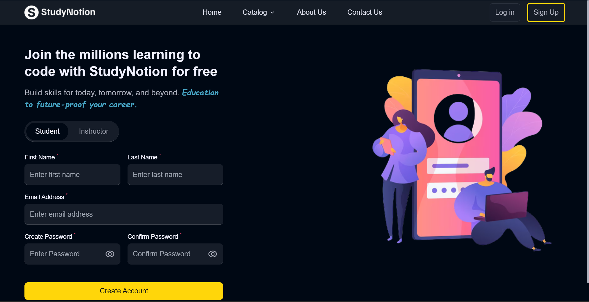
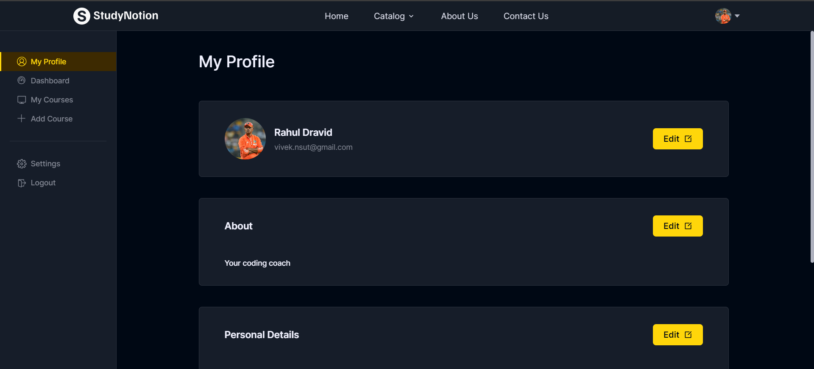
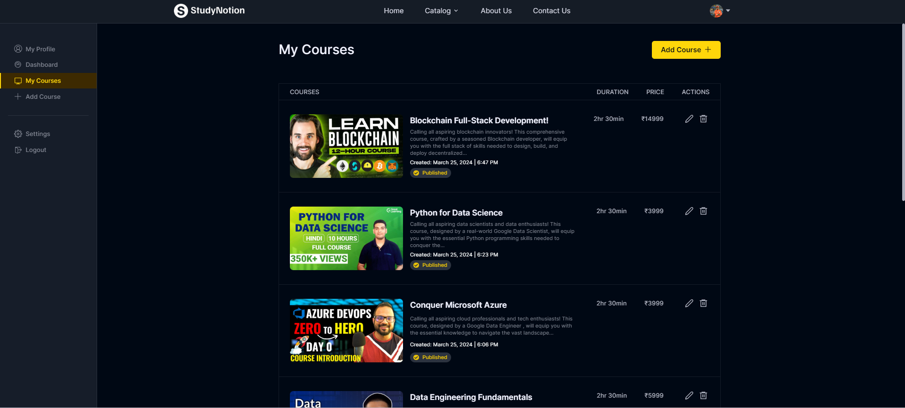
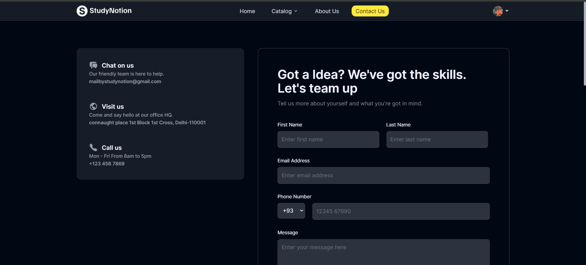

<div align="center">

# 🎓 EduFlux

### A Full-Stack EdTech Platform built with the MERN Stack

[](https://reactjs.org/)
[](https://nodejs.org/)
[](https://mongodb.com/)
[](https://redux-toolkit.js.org/)
[](https://tailwindcss.com/)

**EduFlux** is a fully functional ed-tech platform where students can discover, purchase, and learn from courses, while instructors can create and manage their own content — all in one place.

[Features](#-features) • [Screenshots](#-screenshots) • [Tech Stack](#-tech-stack) • [Architecture](#-architecture) • [Getting Started](#-getting-started) • [API](#-api-overview)

</div>

---

## ✨ Features

### 👨‍🎓 Students
- Browse and search courses by category
- View detailed course pages with curriculum preview
- Secure course purchase via **Razorpay**
- Track enrolled courses and video progress
- Leave ratings and reviews
- Manage profile, display picture, and password

### 👨‍🏫 Instructors
- Create, edit, and delete courses
- Add sections and video sub-sections (uploaded to **Cloudinary**)
- View instructor dashboard with earnings and student stats
- Manage course publish/draft status

### 🔐 Authentication
- OTP-based email verification on signup
- JWT authentication with 24h expiry
- Forgot password via secure email token
- Role-based access: Student / Instructor / Admin

---

## 📸 Screenshots

### Home Page


### Auth Pages
| Login | Signup |
|-------|--------|
|  |  |

### Course Pages
| Course Details | View Course |
|----------------|-------------|
|  |  |

### Dashboard
| Dashboard | Enrolled Courses |
|-----------|-----------------|
|  |  |

### Instructor
| Add Course | My Courses | Instructor Data |
|------------|------------|-----------------|
|  |  |  |

### Other Pages
| About | Contact | Cart |
|-------|---------|------|
|  |  |  |

---

## 🛠 Tech Stack

| Layer | Technology |
|-------|-----------|
| Frontend | React 18, Redux Toolkit, React Router v6 |
| Styling | Tailwind CSS, Framer Motion |
| Backend | Node.js, Express.js |
| Database | MongoDB, Mongoose |
| Auth | JWT, Bcrypt |
| File Storage | Cloudinary |
| Payments | Razorpay |
| Email | Nodemailer (Gmail SMTP) |
| Security | Helmet, CORS, Rate Limiting |

---

## 🏗 Architecture


The project follows a standard **client-server** architecture:

- **Frontend** — React SPA served on port `3000`, communicates with the backend via REST API using Axios
- **Backend** — Express REST API on port `4000`, handles auth, courses, payments, and file uploads
- **Database** — MongoDB Atlas (cloud) stores all users, courses, sections, progress, and reviews
- **Cloudinary** — stores all uploaded images and course videos
- **Razorpay** — handles payment capture and verification via webhooks

### Database Schema


---

## 🚀 Getting Started

### Prerequisites
- Node.js v18+
- npm v9+
- MongoDB Atlas account (free)
- Cloudinary account (free)
- Razorpay account (test mode)
- Gmail account with App Password enabled

### 1. Clone the repo

```bash
git clone https://github.com/Mehul8864/EduFlux.git
cd EduFlux
```

### 2. Install dependencies

```bash
# Frontend
npm install

# Backend
cd server
npm install
```

### 3. Configure environment variables

Create `server/.env` and fill in your credentials:

```env
PORT=4000
NODE_ENV=development

# MongoDB Atlas
MONGODB_URL=mongodb+srv://<username>:<password>@cluster.mongodb.net/eduflux

# JWT
JWT_SECRET=your_random_secret_key

# Cloudinary
CLOUD_NAME=your_cloud_name
API_KEY=your_api_key
API_SECRET=your_api_secret
FOLDER_NAME=EduFlux

# Razorpay
RAZORPAY_KEY=your_razorpay_key_id
RAZORPAY_SECRET=your_razorpay_secret

# Nodemailer (Gmail)
MAIL_HOST=smtp.gmail.com
MAIL_USER=mehul79067@gmail.com
MAIL_PASS=your_gmail_app_password

# Frontend URL
FRONTEND_URL=http://localhost:3000
```

Create `EduFlux/.env` for the frontend:

```env
REACT_APP_BASE_URL=http://localhost:4000/api/v1
```

### 4. Run the project

```bash
# From the EduFlux root — runs both frontend and backend together
npm run dev
```

Or run them separately:

```bash
# Backend (port 4000)
cd server && npm run dev

# Frontend (port 3000)
npm start
```

Open [http://localhost:3000](http://localhost:3000) in your browser.

---

## 📡 API Overview

All backend routes are prefixed with `/api/v1`

| Prefix | Description |
|--------|-------------|
| `/api/v1/auth` | Signup, Login, OTP, Password Reset |
| `/api/v1/profile` | User profile, enrolled courses, dashboard |
| `/api/v1/course` | Courses, sections, subsections, categories, ratings |
| `/api/v1/payment` | Razorpay capture, verify, success email |
| `/api/v1/reach` | Contact us form |

---

## 📁 Project Structure

```
EduFlux/
├── public/                  # Static HTML
├── src/
│   ├── assets/              # Images, videos
│   ├── components/
│   │   ├── common/          # Navbar, Footer, ReviewSlider
│   │   ├── core/            # Auth, Dashboard, HomePage, ViewCourse
│   │   └── ContactPage/
│   ├── data/                # Static data (navbar links, footer links)
│   ├── hooks/               # Custom React hooks
│   ├── pages/               # Route-level pages
│   ├── reducer/             # Redux slices
│   ├── services/            # API calls and endpoints
│   └── utils/               # Helper functions
├── server/
│   ├── config/              # DB, Cloudinary, Razorpay config
│   ├── controllers/         # Route handlers
│   ├── middlewares/         # Auth middleware
│   ├── models/              # Mongoose schemas
│   ├── routes/              # Express routers
│   ├── mail/templates/      # Email HTML templates
│   └── utils/               # Mail sender, image uploader
└── screenshots/             # App screenshots
```

---

## 👤 Author

**Mehul Gupta**

[](https://www.linkedin.com/in/mehul-gupta-b38a2b330/)
[](https://github.com/Mehul8864)

---

<div align="center">
Made with ❤️ by <a href="https://github.com/Mehul8864">Mehul Gupta</a> © 2025 EduFlux
</div>
